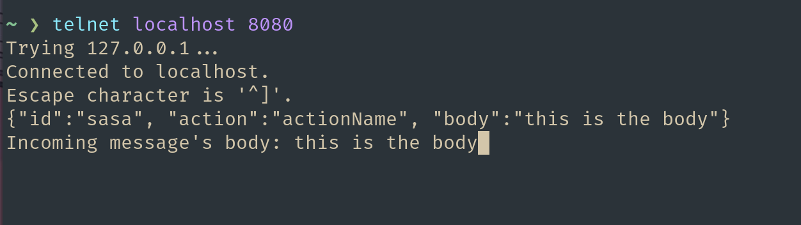

# GoAct Client/Server

## Project
This is a study project inspired by an [interview challenge I found online.](https://app.devgym.com.br/challenges/c8ea75f7-d8b7-4306-89c2-10d155248719)
The challenge consists in creating a Client/Server that can communicate via TCP connection following 
a protocol.

Since the communication will have a simple flow and some basic rules, I decided to make my life
easier by giving the protocol a name that I can refer to in the code and in the project structure 
(also because its way cooler when the project is named).

The server was highly inspired by [Go's standard http lib](https://pkg.go.dev/net/http).
## The protocol - GoAct (GoActions)

### Operation
 - A client CAN send messages to the server.
 - The server CAN send messages to connected clients at any moment after they establish a connection.
 - A request message is a JSON text that contains a client id, an action and an optional body.

### Usage

```
var actionFunc = func (w goact.MessageWriter, body string) error {
    textResponse := fmt.Sprintf("Incoming message's body: %s", body)
    
    _, err := w.Write([]byte(textResponse))
    if err != nil {
        //handle error
    }
    return w.Flush()
}

func main() {
    h := &goact.ActionHandler{}
    h.Register("actionName", actionFunc)

    log.Fatal(goact.ListenAndServe("localhost:8080", h))
}
```

## WIP

- Client implementation
- Server timeout
- Encapsulate server response in a Message 
- Testing
- General improvements
